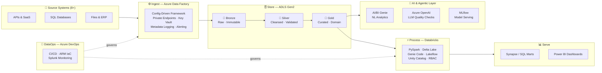

<div align="center">

<!-- ANIMATED WAVE HEADER -->


<!-- PROFILE PHOTO -->


<br/>

<!-- ANIMATED TYPING TAGLINE -->


<br/><br/>

<!-- SOCIAL BADGES -->
[](https://ashishpurohit30.github.io)&nbsp;
[](https://linkedin.com/in/ashishpurohit30)&nbsp;
[](mailto:ashishpurohit3007@gmail.com)&nbsp;
[](assets/Resume_AshishPurohit_v1.pdf)

<br/>

&nbsp;
&nbsp;


</div>

---

## 🎯 Who I Am

> **Results-driven Data Engineering Manager** with 9+ years designing enterprise-grade Azure lakehouse platforms — from metadata-driven ADF ingestion frameworks to AI-augmented Databricks pipelines. I architect systems that are **secure, observable, and built to last** — and I lead the teams that ship them.

I embed **Agentic AI capabilities** — Databricks Genie Code, LLM-powered data quality, RAG pipelines, and Azure OpenAI — into production lakehouse environments. I don't just build data platforms; I build platforms that think.

---

## ⚡ Impact at a Glance

<div align="center">

|  🗓️ 9+ Years  |  ⚙️ 170+ Pipelines  |  📦 4 TB+ Migrated  |  🔗 8+ Source Systems  |  👥 30+ Interviews  |
|:---:|:---:|:---:|:---:|:---:|
| Enterprise Azure data engineering & platform leadership | Designed, modernized, or shipped to production | Zero-downtime cloud migration across two enterprise clients | Integrated via config-driven ADF framework with private endpoints | L1 & L2 technical interviews conducted for data engineering roles |

</div>

---

## 🤖 AI & Agentic Data Engineering *(What's New)*

> This is the frontier I'm actively building on. Not proof-of-concepts — **production systems**.

<table>
<tr>
<td width="50%" valign="top">

### ⚡ Databricks Genie Code *(Agentic)*
Using **Genie Code in agentic mode** to auto-generate PySpark transformation notebooks and Lakeflow pipelines from business specifications — cutting pipeline development time by **~40%**. Also using it to debug and self-heal production failures from natural language instructions.

</td>
<td width="50%" valign="top">

### 💬 Databricks AI/BI Genie *(NL Analytics)*
Deployed **AI/BI Genie** over curated Gold-layer Delta tables to enable natural-language analytics for business stakeholders — reducing ad-hoc data request turnaround by **~60%** without writing a line of SQL.

</td>
</tr>
<tr>
<td width="50%" valign="top">

### 🔍 RAG Pipelines & LLM Quality Checks
Built **LLM-assisted data quality frameworks** using **Azure OpenAI + Databricks Model Serving** to detect anomalies in raw ingestion before they reach the Gold layer. Integrated **MLflow** for model lifecycle, and **Databricks Vector Search** for semantic retrieval over enterprise data assets.

</td>
<td width="50%" valign="top">

### 🧠 LLM Tooling Ecosystem
Hands-on with **LangChain**, **LangGraph**, **Azure OpenAI**, **MLflow**, **Prompt Engineering**, and **Unity Catalog governance for AI assets**. Actively upskilling in **LLMOps** and **agentic workflow orchestration** (Genie Code / LangGraph).

</td>
</tr>
</table>

**AI Stack I work with:**


---

## 🏗️ Architecture: Azure AI Lakehouse Platform



> **Every layer is governed** by Unity Catalog (RBAC, lineage, audit), secured via private endpoints, and promoted through automated CI/CD with ARM templates.

---

## 🛠️ Core Technology Stack

<div align="center">

**☁️ Azure Data Platform**


**⚡ Processing & Storage**


**🛡️ Governance, DevOps & MLOps**


</div>

---

## 🚀 Signature Projects

### 🏥 Enterprise AI Lakehouse — US Pharmaceutical Client

> **`ADF` + `Databricks` + `Delta Lake` + `ADLS Gen2` + `Genie Code` + `Azure OpenAI`**

<table>
<tr>
<td><b>📊 50+ Pipelines</b></td>
<td><b>🔗 8+ Source Systems</b></td>
<td><b>⚡ ~40% Dev Time Saved</b></td>
<td><b>💬 ~60% Faster Analytics</b></td>
</tr>
</table>

- 🏗️ Architected a **config-driven, metadata-based ADF ingestion framework** connecting 8+ source systems via private endpoints — reduced new source onboarding from **weeks to days**
- 🥇 Designed end-to-end **Medallion Lakehouse** (Bronze → Silver → Gold) with Databricks, Delta Lake, and ADLS Gen2 — 50+ production pipelines at scale
- 🤖 Integrated **Databricks Genie Code** to auto-generate PySpark transformation notebooks from business specs — **~40% pipeline dev time reduction**
- 💬 Deployed **AI/BI Genie** over Gold-layer tables for natural-language business analytics — **~60% reduction** in ad-hoc data turnaround
- 🔍 Built **LLM-assisted data quality framework** (Azure OpenAI + Model Serving) to detect raw ingestion anomalies before they hit the Gold layer
- 🛡️ Implemented **Unity Catalog** for schema-level RBAC, lineage tracking, and audit logging across the entire lakehouse
- 📦 Automated **Delta table maintenance** (optimize/vacuum/retention) — measurable monthly compute cost savings
- 🚀 IaC-based **CI/CD with selective partial promotions** for ADF pipelines across environments via Azure DevOps

---

### 🚗 Enterprise EDW Migration — US Auto Auctions Client

> **`Azure Synapse` + `Azure SQL DW` + `Databricks` + `T-SQL` + `Azure DevOps`**

<table>
<tr>
<td><b>📦 4 TB+</b> Migrated</td>
<td><b>⚙️ 120+ Pipelines</b> Modernized</td>
<td><b>📐 80+ Dimension/Fact Tables</b></td>
<td><b>📈 ~35% Release Velocity Increase</b></td>
</tr>
</table>

- ☁️ Led **zero-downtime migration** of a 4TB+ enterprise data warehouse from legacy on-prem BI to **Azure Synapse Analytics**
- 🔄 Re-engineered **120+ SSIS packages** into Synapse pipelines; converted **60+ stored procedures** to Azure SQL DW-compatible T-SQL with full parity validation
- 📊 Built **near real-time Power BI activity logging** via REST APIs and robust file quarantine pipelines for data corruption handling
- 🚀 Established **Git branching strategies** enabling 4+ parallel development teams — release velocity up **~35%**
- 🔐 Implemented **CI/CD promotions** with environment-parameterized connections, ARM-managed secrets, and deployment validation gates

---

## 💼 Experience Timeline

<table>
<tr>
<th>Period</th>
<th>Role</th>
<th>Organization</th>
<th>Highlights</th>
</tr>
<tr>
<td><b>Jan 2024<br/>→ Present</b></td>
<td>🏆 <b>Data Engineering Manager</b><br/>Data Management</td>
<td>Blue Altair<br/>India Pvt. Ltd.</td>
<td>AI/Agentic lakehouse · Unity Catalog · Genie Code · Team leadership · Partner Connect Lead</td>
</tr>
<tr>
<td><b>Jan 2022<br/>→ Dec 2023</b></td>
<td>⭐ <b>Senior Consultant</b><br/>Data Management</td>
<td>Blue Altair<br/>India Pvt. Ltd.</td>
<td>4TB+ EDW migration · CI/CD frameworks · Medallion architecture · Founders Award 2023</td>
</tr>
<tr>
<td><b>Jun 2020<br/>→ Dec 2021</b></td>
<td>🔵 <b>Consultant</b><br/>Data Management</td>
<td>Blue Altair<br/>India Pvt. Ltd.</td>
<td>Azure Synapse · ETL modernization · REST API pipelines · DevOps branching strategy</td>
</tr>
<tr>
<td><b>May 2017<br/>→ Jun 2020</b></td>
<td>💻 <b>Application Dev Analyst</b></td>
<td>Accenture</td>
<td>Angular 6 · Node.js · MongoDB · Full-stack delivery for US digital marketing client</td>
</tr>
</table>

---

## 🏆 Recognition & Awards

<table>
<tr>
<td align="center" width="33%">

### 🏆 Founder's Award
**Blue Altair · 2023**

Recognised by Blue Altair's founders for exceptional performance across simultaneous multi-client, multi-project delivery with consistently strong customer outcomes.

</td>
<td align="center" width="33%">

### ⭐ Multiple Spot Awards
**Blue Altair · 2020–2024**

Repeatedly recognised for delivery excellence, end-to-end ownership, proactive issue resolution, and exceptional client impact across data engineering engagements.

</td>
<td align="center" width="33%">

### 🎓 Director's Medal
**JECRC · 2017**

Awarded 3rd rank in 6th semester and the Director's Medal for academic excellence in B.Tech (Hons) Computer Science & Engineering at Rajasthan Technical University.

</td>
</tr>
</table>

---

## 📐 Competency Map

```
Data Platform Architecture    ████████████████████  Expert
Azure Data Factory (ADF)      ████████████████████  Expert
Apache Spark / PySpark        ████████████████████  Expert
Azure Databricks              ████████████████████  Expert
Delta Lake / Lakehouse        ███████████████████░  Expert
CI/CD & DataOps               ██████████████████░░  Advanced
Unity Catalog / Governance    ██████████████████░░  Advanced
Genie Code / AI/BI Genie      █████████████████░░░  Advanced ⚡ Active
Azure OpenAI / LLMs / RAG     ████████████████░░░░  Proficient ⚡ Active
LangChain / LangGraph         ████████████████░░░░  Proficient ⚡ Upskilling
MLflow / LLMOps               ███████████████░░░░░  Proficient ⚡ Upskilling
```

---

## 🎓 Education & Continuous Learning

**🏫 B.Tech. (Hons) in Computer Science & Engineering**
JECRC Jaipur · Rajasthan Technical University · `2013 – 2017` · Director's Medal Recipient

**📚 Certifications & Learning**


-0078D4?style=flat-square&logo=microsoftazure&logoColor=white)


---

## 📬 Let's Connect

<div align="center">

*I welcome conversations around data engineering leadership, Azure lakehouse modernization, Databricks &amp; AI platform architecture, and scaling data teams.*

<br/>

[](https://ashishpurohit30.github.io)&nbsp;
[](https://linkedin.com/in/ashishpurohit30)&nbsp;
[](mailto:ashishpurohit3007@gmail.com)&nbsp;
[](tel:+919413846168)

<br/>

<!-- ANIMATED WAVE FOOTER -->


</div>
